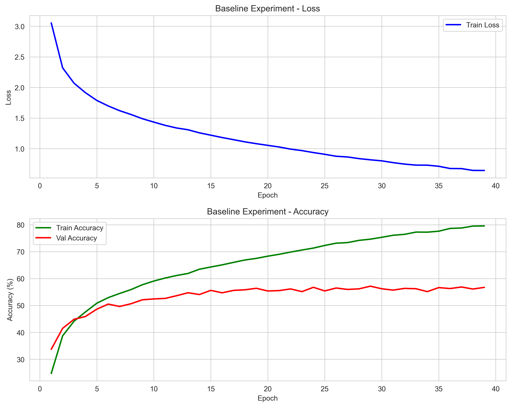
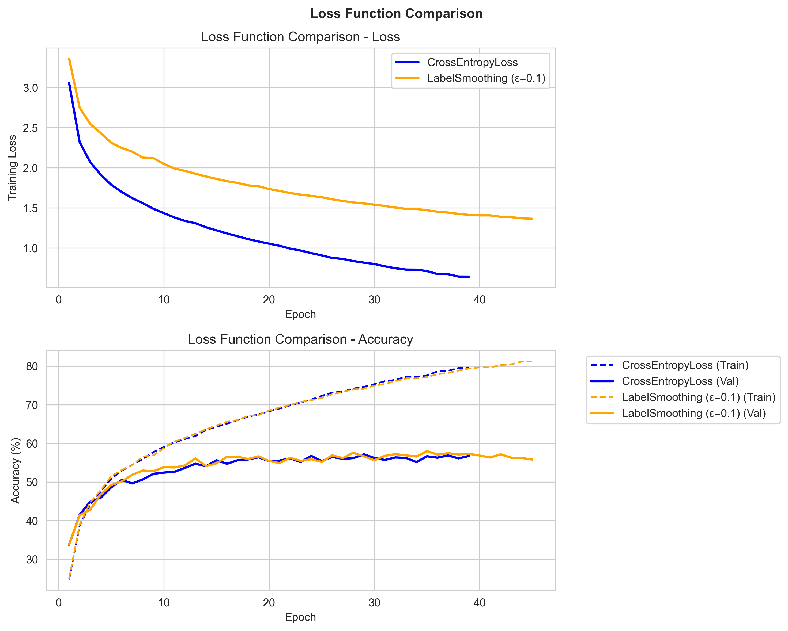
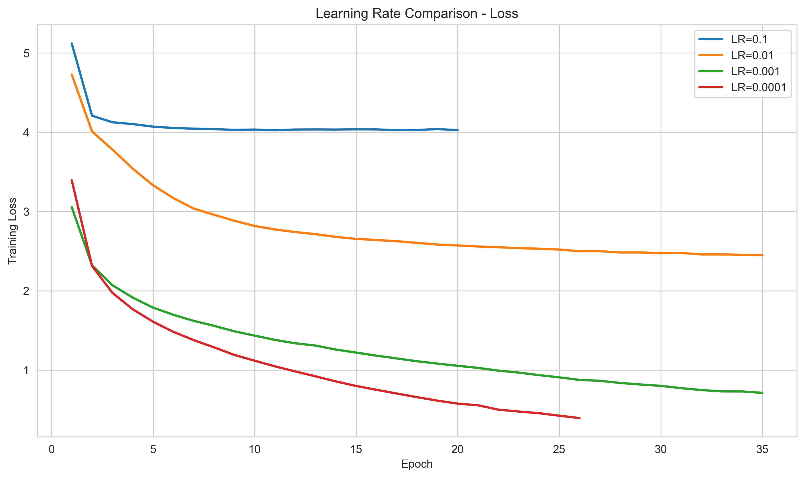
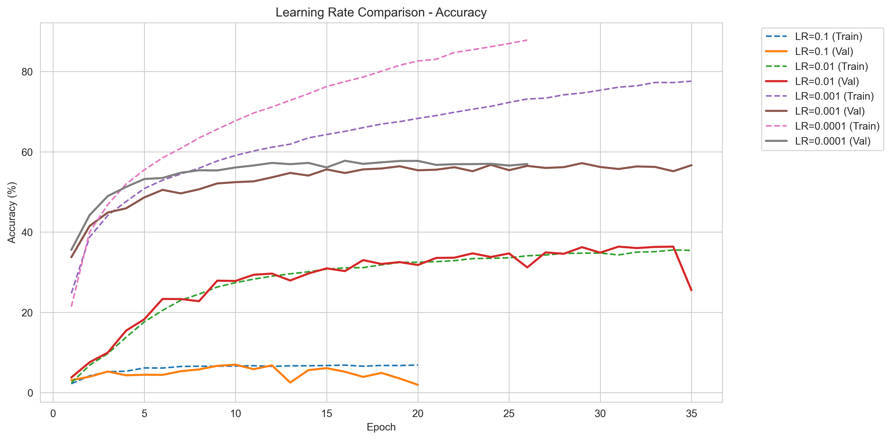
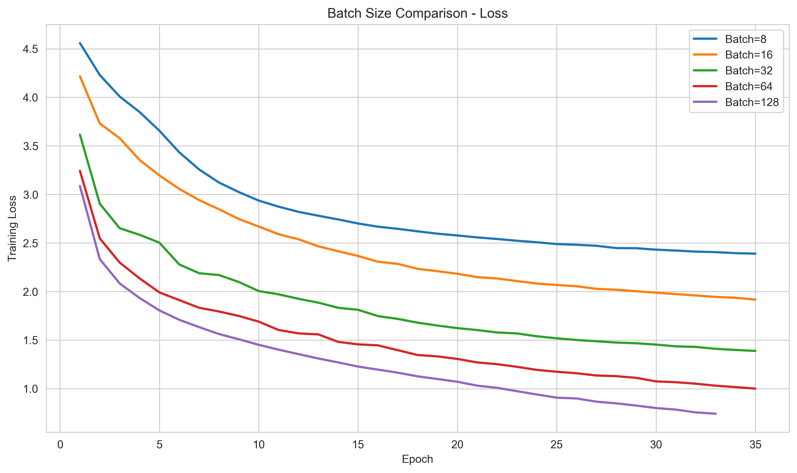
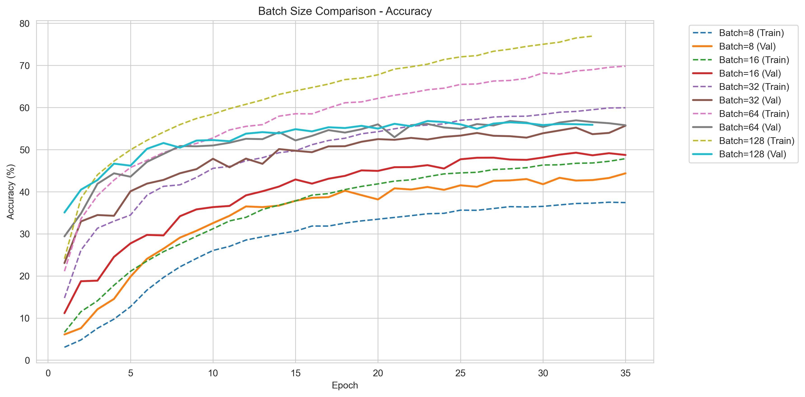
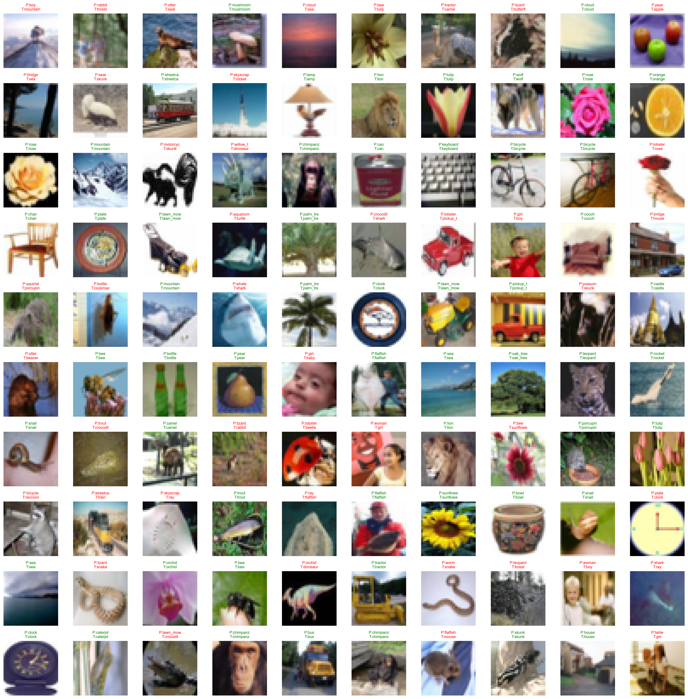

# CDS 525 Group Project Report
## CIFAR-100 Image Classification: Fine-tuning ResNet18 with Hyperparameter Comparison

---

## 1. Introduction

Image classification — assigning a label to a photograph — sits at the core of applications ranging from medical imaging and autonomous driving to content moderation and product search. This project addresses image classification using the CIFAR-100 dataset. CIFAR-100 contains 60,000 colour images of size 32×32, distributed across 100 classes — 50,000 for training and 10,000 for testing. The 100 classes span animals, vehicles, household objects, and natural scenes, making it noticeably harder than CIFAR-10 — at 32×32 pixels with 100 classes, many categories share enough visual features that even careful inspection can be genuinely ambiguous.

We chose this dataset because 100 classes at 500 training images each is a genuine challenge — there is no getting by on memorisation, so the quality of the learned features actually has to be good.

In terms of current approaches, convolutional neural networks (CNNs) — particularly residual networks — remain the dominant choice for CIFAR-100 classification. Vision Transformers (ViT) have shown strong results on large-scale datasets, but typically require substantial amounts of data or additional pre-training to perform well at CIFAR-100's scale. Efficient scaling architectures such as EfficientNet have also shown competitive performance on this benchmark. We therefore chose ResNet18 as the backbone model, using ImageNet pre-trained weights as a starting point and fine-tuning all layers for the 100-class task.

---

## 2. Design and Functions

### 2.1 Overall Structure

The code is organised into separate modules under `src/`, driven by YAML configuration files in `config/`. This makes it straightforward to run different experiment variants without modifying the source code directly.

```
src/
├── data_loader.py   # Data loading and augmentation
├── model.py         # Model definition
├── trainer.py       # Training loop with early stopping
├── evaluator.py     # Top-1 and Top-5 accuracy evaluation
├── visualizer.py    # Figure generation
└── utils.py         # Seed, device, config utilities
```

Experiments are configured via four YAML files (`exp1_baseline.yaml`, `exp2_loss.yaml`, `exp3_lr.yaml`, `exp4_batch.yaml`) and executed through `experiments/run_all_experiments.py`, which also handles the multi-variant loops for learning rate and batch size comparisons.

### 2.2 Model

We use ResNet18 from torchvision, loaded with ImageNet pre-trained weights (`ResNet18_Weights.IMAGENET1K_V1`). The final fully-connected layer is replaced to output 100 classes instead of 1,000:

```python
# src/model.py
weights = models.ResNet18_Weights.IMAGENET1K_V1 if pretrained else None
model = models.resnet18(weights=weights)
model.fc = nn.Linear(512, 100)
```

The model has approximately 11.23M parameters, all of which are unfrozen and updated during training. We chose full fine-tuning rather than feature extraction because the distribution of CIFAR-100 images (low resolution, diverse categories) differs enough from ImageNet that only updating the classifier head tends to underperform.

ResNet18 was chosen over deeper variants (ResNet50, ResNet101) primarily for training speed — each epoch takes roughly 12–13 seconds on the RTX 5070, making a full run of 11 experiment variants feasible within a few hours.

### 2.3 Data Preparation

The official training set (50,000 images) is split into a training subset (45,000, 90%) and a validation subset (5,000, 10%) using `torch.utils.data.random_split` with a fixed seed for reproducibility. The official test set (10,000 images) is held out entirely and only used for final evaluation after training completes.

Data augmentation is applied only to training samples:

- **Training**: `RandomCrop(32, padding=4)` → `RandomHorizontalFlip` → `Normalize`
- **Validation / Test**: `Normalize` only

The normalisation uses CIFAR-100 channel statistics: `mean=[0.5071, 0.4867, 0.4408]`, `std=[0.2675, 0.2565, 0.2761]`.

One implementation detail worth noting: after `random_split`, both subsets initially share the same underlying dataset object (with training augmentation). To ensure the validation subset uses the clean transform, we replace `val_dataset.dataset` with a freshly loaded instance of the same dataset using the test transform. Without this step, the validation numbers would include images that got randomly cropped or flipped, which isn't what we want.

### 2.4 Loss Functions

Two loss functions are compared:

**CrossEntropyLoss** (baseline): Standard cross-entropy with hard one-hot targets. The model is trained to assign full probability mass to the correct class.

**LabelSmoothingCrossEntropy** (`smoothing=0.1`, implemented in `experiments/run_experiment.py`): Soft labels replace the hard one-hot targets. The correct class receives a target probability of 0.9, with the remaining 0.1 distributed uniformly across the other 99 classes. In practice this keeps the model from pushing too hard toward a single class — with 100 visually overlapping categories, that kind of overconfidence tends to hurt.

### 2.5 Optimiser and Training Strategy

All experiments use the Adam optimiser with `weight_decay=0.0001`. The base learning rate is 0.001.

Early stopping monitors validation accuracy with a patience of 10 epochs — training halts if validation accuracy does not improve for 10 consecutive epochs. The best checkpoint is saved to `checkpoints/<experiment_name>/best_model.pth` and loaded back before test-set evaluation. Without this, reported test accuracy would depend on whatever state training happened to stop at, not the best the model actually reached.

### 2.6 Experiment Design

Four experiment groups are defined:

| Experiment | Variable | Fixed Settings |
|------------|----------|---------------|
| Exp1 (Baseline) | — | CE Loss, lr=0.001, batch=128, 50 epochs |
| Exp2 (Loss Function) | LabelSmoothing vs CE | Same as Exp1 |
| Exp3 (Learning Rate) | 0.1 / 0.01 / 0.001 / 0.0001 | CE Loss, batch=128, 35 epochs |
| Exp4 (Batch Size) | 8 / 16 / 32 / 64 / 128 | CE Loss, lr=0.001, 35 epochs |

Experiments 3 and 4 use 35 epochs rather than 50 to keep total runtime reasonable. 35 epochs is enough to see how each setting converges — we are mainly looking at the trends, not trying to squeeze out maximum accuracy.

---

## 3. Demonstration and Performance

### 3.1 Dataset Description

CIFAR-100 organises its 100 classes into 20 superclasses of 5 subclasses each. For example, the superclass "aquatic mammals" contains beaver, dolphin, otter, seal, and whale. All images are 32×32 pixels — small enough that fine-grained features (e.g. distinguishing a fox from a wolf) can be ambiguous even to human observers.

After the 90/10 split, the training set produces 352 batches per epoch at batch size 128. The validation set has 40 batches, and the test set has 79.

### 3.2 Performance Figures

**Figure 1: Baseline Training Curves (Exp1)**

Two-panel figure: training loss per epoch (top) and training vs. validation accuracy per epoch (bottom).



Training stopped at epoch 39 (early stopping, patience=10). The training loss fell from 3.05 at epoch 1 to 0.72. The accuracy curves diverge from around epoch 5: training accuracy climbs to ~80% while validation accuracy peaks at 57.18% at epoch 29 and then oscillates between 55–57% without further improvement. Validation accuracy is used as the per-epoch proxy rather than test accuracy — evaluating on the test set each epoch would allow it to influence checkpoint selection, so test accuracy is computed only once after training completes. **Final test Top-1 Acc = 57.11%, Top-5 Acc = 83.67%**.

---

**Figure 2: Loss Function Comparison (CrossEntropy vs LabelSmoothing)**

Side-by-side comparison of training loss and accuracy curves for the two loss functions under identical other conditions.



LabelSmoothing produces higher absolute training loss values throughout (~1.37 at epoch 45 vs ~0.72 for CE), but this is expected: smoothing reduces the target probability for the correct class to 0.9, which raises the theoretical loss floor. The two values are not directly comparable. Looking at the accuracy panel, the two validation curves are nearly identical, both ending around 56–57%. LabelSmoothing took 45 epochs to trigger early stopping (CE: 39), suggesting slightly more stable convergence. The final test accuracy difference is negligible (57.52% vs 57.11%), and the train–val accuracy gap did not narrow meaningfully.

---

**Figure 3: Learning Rate Comparison — Loss Curves**

Training loss curves for lr ∈ {0.1, 0.01, 0.001, 0.0001} over 35 epochs.



lr=0.1 spikes to loss ≈ 5.1 at epoch 1, then stalls at ~4.0 for all 35 epochs — Adam with such a large step size oscillates rather than converging. lr=0.01 descends slowly, reaching ~2.4 at epoch 35. Both lr=0.001 and lr=0.0001 descend smoothly; lr=0.0001 reaches the lowest final loss (~0.35) but its curve ends at epoch 26 when early stopping triggers.

---

**Figure 4: Learning Rate Comparison — Accuracy Curves**



lr=0.1 stays near 5–7% throughout — the model barely learns. The validation curves for lr=0.001 and lr=0.0001 nearly overlap, both reaching ~57% test accuracy, though lr=0.0001 pushes training accuracy to ~88% within 26 epochs, indicating deeper overfitting. lr=0.01's validation curve is still rising at epoch 35, confirming it needs far more epochs to converge (final test: 34.99%). **lr=0.001 gives the most stable convergence and best practical result**.

---

**Figure 5: Batch Size Comparison — Loss Curves**



Larger batches converge to lower training loss within the same epoch budget. batch=128 reaches ~0.75 at epoch 35; batch=8 is still at ~2.4. With batch=8 each update uses only 8 samples, producing high-variance gradients that frequently cancel out — effective learning per epoch is much lower despite more individual update steps.

---

**Figure 6: Batch Size Comparison — Accuracy Curves**



batch=64 (56.65%) and batch=128 (56.40%) are nearly tied; batch=32 drops to 55.55%; batch=16 and batch=8 fall considerably behind at 49.57% and 43.42%. batch=8's training accuracy is only ~38% — close to its validation accuracy not because it generalises well, but because the model has not converged on the training set itself. Within this 35-epoch budget, small batches did not demonstrate a generalisation advantage; slower convergence outweighed any regularisation benefit.

---

**Figure 7: Prediction Visualisation (First 100 Test Samples)**

A 10×10 grid showing each image with its predicted and true class label. Misclassified samples are marked with red text. Class names are retrieved from CIFAR-100's built-in label list via `src/utils.py`.



Based on an overall test accuracy of 57.11%, approximately 57 of the 100 shown samples are predicted correctly (green text) and 43 incorrectly (red text with red border). Most errors occur between visually similar categories — different animal species or vehicle types — which is expected given the 32×32 resolution and the fine-grained nature of CIFAR-100's 100 classes.

---

### 3.3 Parameter Selection Discussion

**Effect of Learning Rate:**

lr=0.1 is clearly too large for Adam on this task — the loss spikes at epoch 1 and stalls near 4.0 for the full 35 epochs, with accuracy never exceeding 7%. lr=0.01 converges but too slowly: the validation curve is still rising at epoch 35 and only reaches 34.99%. lr=0.001 is the practical optimum here, with smooth convergence and 57.11% test accuracy. lr=0.0001 matches the same final accuracy but pushes training accuracy to ~88% before early stopping at epoch 26 — the pretrained weights already provide a strong initialisation, so the smaller learning rate causes deeper fitting of the training set without generalisation gain.

**Effect of Batch Size:**

Under the fixed 35-epoch budget, larger batches consistently outperform smaller ones. batch=64 (56.65%) and batch=128 (56.40%) are nearly tied; batch=32 drops to 55.55%; batch=16 and batch=8 fall to 49.57% and 43.42%. batch=8 performs 5,625 gradient updates per epoch (vs 352 for batch=128), but each update uses only 8 samples, so gradient direction noise is high and updates partially cancel out. The training accuracy for batch=8 is only ~38% at epoch 35 — the model has not converged on the training set itself. Small batches showed no generalisation edge here — within 35 epochs they simply had not converged far enough for any regularisation benefit to show up.

**Loss Function Comparison:**

The accuracy difference between LabelSmoothing and CrossEntropy is under 0.5 percentage points (57.52% vs 57.11%). The higher training loss values under LabelSmoothing are not indicative of worse learning — smoothing caps the target probability at 0.9, raising the theoretical loss floor, so the two loss curves are not directly comparable. In the accuracy panel, the two validation trajectories are nearly indistinguishable, and the train–val gap is similar in both cases, suggesting minimal regularisation benefit at this scale. What did stand out was training stability — LabelSmoothing needed 45 epochs to trigger early stopping (vs 39 for CE), with less fluctuation in the validation curve.

---

## 4. Conclusion

This project fine-tuned ResNet18 on CIFAR-100 and compared how loss function, learning rate, and batch size each affect training.

A few implementation details came up during development worth noting. The validation subset uses a separate dataset instance with the clean transform rather than sharing the augmented training dataset — otherwise random crops and flips would end up in validation and push the numbers up artificially. The early stopping mechanism monitors validation accuracy rather than training loss, and the final test evaluation loads the best saved checkpoint (`best_model.pth`) rather than using the last-epoch weights. Without this, test accuracy would reflect the model's state at an arbitrary stopping point rather than its best generalising state.

The main limitation of the current setup is that ResNet18 was designed for 224×224 images. Its first convolutional layer uses a 7×7 kernel with stride 2 followed by max pooling, which aggressively reduces spatial resolution before the residual blocks begin. On 32×32 CIFAR images, this discards potentially useful fine-grained spatial information early on. Replacing the first conv with a 3×3 kernel and dropping the early max pooling would probably close some of that gap — it's a small change that doesn't touch anything else in the network.

We also kept augmentation minimal — just random crop and horizontal flip. CutMix, Mixup, and AutoAugment are standard tricks for this benchmark that we didn't get to try, but they'd probably push the numbers up a few points.

---

## 5. References

1. He, K., Zhang, X., Ren, S., & Sun, J. (2016). Deep residual learning for image recognition. *Proceedings of CVPR 2016*, 770–778.
2. Krizhevsky, A. (2009). Learning multiple layers of features from tiny images. *Technical Report*, University of Toronto.
3. Müller, R., Kornblith, S., & Hinton, G. (2019). When does label smoothing help? *Advances in Neural Information Processing Systems (NeurIPS)*, 32.
4. Loshchilov, I., & Hutter, F. (2019). Decoupled weight decay regularization. *ICLR 2019*.
5. PyTorch Documentation. torchvision.models.resnet18. https://pytorch.org/vision/stable/models/generated/torchvision.models.resnet18.html
